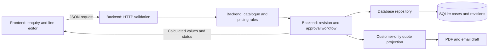

# QuoteFlow architecture and team workflow

QuoteFlow runs as one localhost application with separate frontend, backend and
database ownership. A single Python process serves the browser files and API.
The separation does not require three servers, a new framework or a new database.

## Folder ownership

```text
app/
  server.py                 Stable command-line launcher
  frontend/
    index.html              Browser entry point
    css/style.css           Layout, responsive styles and specification badges
    js/app.js               Views, UI state and API requests
    js/specifications.js    Accessible product-specification icons and labels
  backend/
    http.py                 HTTP routing, request checks and workflow coordination
    domain.py               Catalogue parsing, validation and Decimal pricing
    workflow.py             Demo approval requests, decisions and revision hashes
    documents.py            Customer-only PDF and email rendering
  database/
    schema.sql              SQLite tables and keys
    repository.py           Initialization, transactions and all SQL operations
  tests/
    test_domain.py          Catalogue and pricing behavior
    test_workflow.py        Approval rules and invalidation
    test_database.py        Persistence, rollback and immutable snapshot keys
    test_server.py          Live HTTP workflow and access checks
    test_requests.py        Same request paths in memory, without sockets
    browser.cjs             Desktop/mobile interaction tests
    specifications.cjs      Specification labels, values and escaping
  data/cases.db             Local runtime database; ignored by Git
  requirements.txt          Python dependencies
docs/demo/fixtures.json     Versioned synthetic catalogue and source records
docs/demo/golden-cases.json Acceptance cases
```

## Request workflow



1. The browser sends enquiry text or edited line inputs to the API. Browser
   fields never define authoritative totals or approval authority.
2. The backend checks request size, localhost session/origin and demo-persona
   permissions. It matches catalogue products, validates units and quantities,
   and calculates commercial values using Decimal.
3. The workflow applies revision and approval gates. Edits create a new revision;
   stale decisions and missing approvals cannot mark a quote reviewed.
4. The repository saves the case and its revision input snapshot in a transaction.
   Failed transactions roll back; existing revision keys cannot be overwritten.
5. The frontend displays server results. Exports use a customer-only projection
   that excludes costs, margins and internal approval notes.

## Database

`cases` stores one current JSON case per ID: source text, line inputs, consent,
review flag, approval tasks and decision events. `revisions` stores an input JSON
snapshot under the unique `(case_id, revision)` key. SQL lives only in the
repository/schema, not the frontend or business rules.

Initialization creates missing tables and backfills the current snapshot of an
existing case once. The database remains at `app/data/cases.db`, so this folder
refactor does not require moving or deleting saved cases. Full relational models,
external audit storage and production migrations remain future work.

## Product specification icons

| Catalogue fact | Icon | Example |
| --- | --- | --- |
| Current rating | Zap | 16 A |
| Pole count | Split | 1 pole |
| Trip curve | Activity | C curve |
| Cable cross-section / enclosure dimensions | Ruler | 2.5 mm2 / 200 x 150 mm |
| Cable length | Cable | 100 m |
| Lighting power | Lightbulb | 36 W |
| Colour temperature | Thermometer | 4000 K |
| Ingress protection | Shield check | IP65 |
| Material | Layers | Copper, ABS or metal |
| Pack size | Package | 10 EA / pack |

These Lucide icons appear beside text in Resolve and Pricing. Each value comes
from the selected catalogue record, with a descriptive tooltip and accessible
label. An unresolved product has no specification badges. Icons are not evidence
of certification or any rating beyond the displayed mock catalogue field.

## Teammate workflow

Everyone works on `codex/working-demo`, not `main`. Pull before starting, agree
file ownership with teammates and commit focused changes. Do not overwrite or
reset another teammate's uncommitted work.

Frontend changes belong in `app/frontend/`; backend rules and API changes in
`app/backend/`; schema and persistence changes in `app/database/`. Coordinate API
field changes with the frontend and add tests under `app/tests/` for the affected
behavior. Keep fixtures and the demo decision contract consistent with code.

From the repository root, using the virtual environment's Python:

```bash
python -m unittest discover -s app/tests -v
python docs/demo/verify_fixtures.py
node --test app/tests/specifications.cjs
node --check app/frontend/js/app.js
python -m app.server --port 8765
```

The launch command is unchanged. After updating Python modules or moving browser
files, restart the server and reload the page. Browser checks still run with
`node app/tests/browser.cjs` against the running server. Setup instructions are
in the root README. Demo personas are simulated identities, not production login.
